# DSO101: Continuous Integration and Continuous Deployment - Final Project
## Project Overview
This project implements a DevSecOps pipeline for a PERN stack (PostgreSQL, Express, React, Node.js) application using free-tier tools:

- **Jenkins** (for automated GitHub pushes)

- **GitHub Actions** (for Docker builds & pushes)

- **Docker Hub** (for container storage)

- **Render** (for deployment)

The goal is to **automate code synchronization, deployment, and security checks** while adhering to **zero-cost constraints.**

## Repository Setup

1. **Create a GitHub Repository**: Initialized a new repository for assignment. [DSO-FinalAssignment](https://github.com/C-gyeltshen/DSO-FinalAssignment.git)
2. **Clone the Repository**: Cloned the repository to your local machine.

   ```bash
   git clone https://github.com/adefrutoscasado/pern-dockerized-stack.git
   ```
   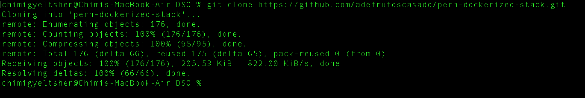
3. Remove the existing `.git` directory to start fresh:

   ```bash
   rm -rf .git
   ```
   

4. **Initialize a New Git Repository**: Initialize a new Git repository in the cloned directory.
   ```bash
   git init
   git add .
   git commit -m "Initial commit"
   git remote add origin https://github.com/C-gyeltshen/DSO-FinalAssignment.git
    git branch -M main
    git push -u origin main
   ```
    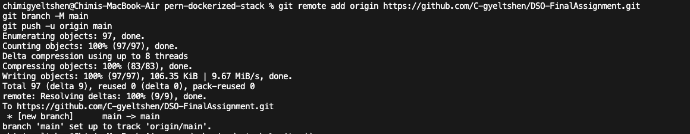

## Project Structure
The project is structured as follows:

```
├── backend/
├── docker/
├── frontend/
├── image/
├── LICENSE.md
└── README.md
```

## BMI Setup Instructions

### 1. **backend/**: Contains the Node.js and Express backend code.

   ```bash 
   cd backend
   npm install
   ```
   * Create a `postgres database` in `render.com`.

      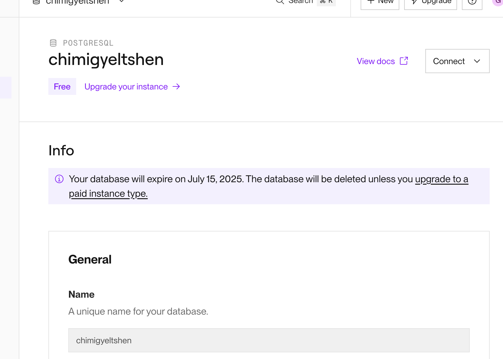

   * Create a `.env` file in the `backend` directory with the following content:

      ```bash
      DATABASE_HOST="your database host"
      DATABASE_PORT="port your db is rinning on"
      DATABASE_USER="your database username"
      DATABASE_PASSWORD="database password"
      DATABASE_NAME="your database name"
      ```

   * Run the backend server:

      ```bash
      npm start
      ```
      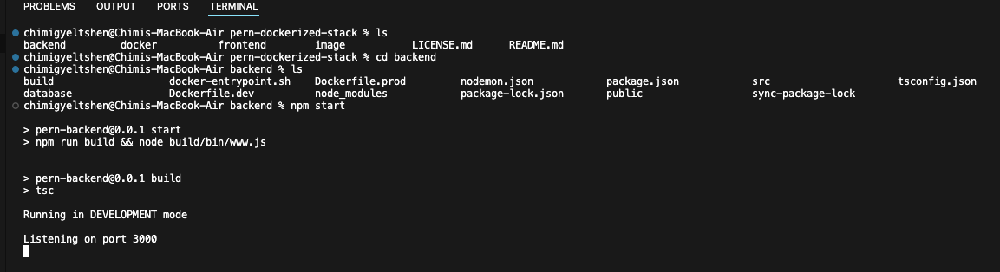


### 2. **frontend/**: Contains the React frontend code.

   ```bash
   cd frontend
   npm install
   ```
   ```bash
   npm start
   ```
   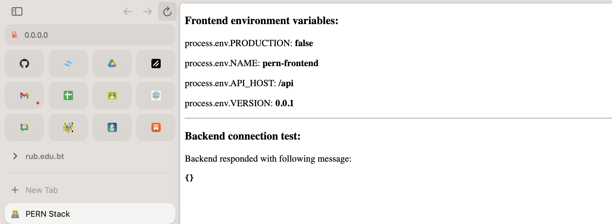

   * Edit the `src/app.js` file and add code for the BMI calculator:

      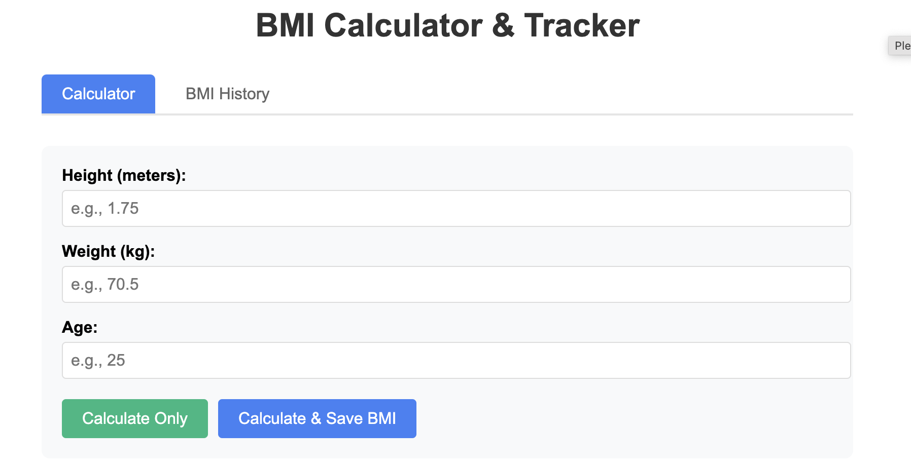

### 3. **Database Setup**

   * Create `bmi_recordes` table in the database using the following SQL command:

      ```sql
      CREATE TABLE bmi_records (
         id SERIAL PRIMARY KEY,
         height NUMERIC(5,2) NOT NULL,
         weight NUMERIC(5,2) NOT NULL,
         age INTEGER NOT NULL,
         bmi NUMERIC(5,2) NOT NULL,
         created_at TIMESTAMPTZ DEFAULT NOW()
      );
      ```
      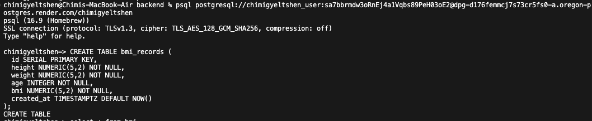
      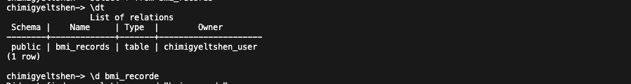
      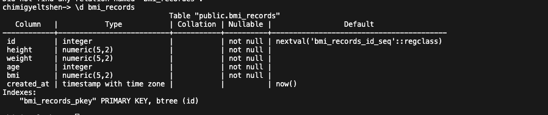

### 3. Add new endpoint in `backend/routes/bmi.js`:

   * Insert dummy data in `bmi_records` table using the following SQL command:

      ```sql
      INSERT INTO bmi_records (height, weight, age, bmi)
      VALUES 
      (1.60, 50, 22, 19.53),
      (1.75, 70, 25, 22.86),
      (1.68, 80, 30, 28.32),
      (1.82, 90, 35, 27.17),
      (1.55, 45, 20, 18.73),
      (1.90, 100, 40, 27.7),
      (1.72, 65, 28, 21.97),
      (1.78, 85, 32, 26.8),
      (1.60, 60, 26, 23.44),
      (1.70, 95, 38, 32.87);
      ```
      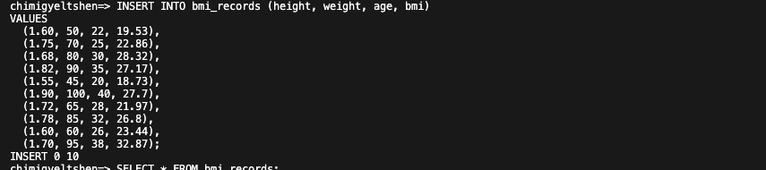

   * Check the database to ensure the data is inserted correctly:

      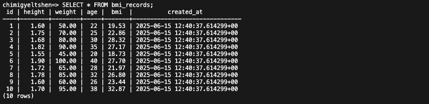

   * Create `endpoint` to get all BMI records:

      ```bash
         touch backend/routes/bmi.js
      ```

      ```javascript
         import { Router, Request, Response } from 'express'
         import { errorHandler } from '../utils'
         import knex from 'knex'
         import { databaseConfig } from '../config'

         const router = Router()
         const db = knex(databaseConfig)

         // GET /api/user/bmi - fetch all BMI records
         router.get('/user/bmi', errorHandler(async (req: Request, res: Response) => {
         const records = await db('bmi_records').select('*').orderBy(' created_at ', 'desc')
         res.json(records)
         }))

         export default router
      ```

   * Create new `endpoint` for add BMI records under `backend/routes/bmi.js`:

      ```javascript
         router.post('/create/bmi', errorHandler(async (req: Request, res: Response) => {
         const { id, height, weight,age, bmi } = req.body;

         if (!id || !height || !weight || !age || !bmi) {
            return res.status(400).json({ message: 'Missing required fields' });
         }

         const [record] = await db('bmi_records')
            .insert({ id, height, weight, bmi })
            .returning('*');

         res.status(201).json(record);
         }));
      ```

## Writing Tests

* Install the required dev dependencies for testing:

   ```bash
   npm install --save-dev jest supertest @types/jest @types/supertest
   ```

* Create test file `backend/tests/bmi.test.js`:

   ```javascript
   import request from 'supertest';
   import app from '../app'; // Adjust the path to your Express app

   describe('BMI API', () => {
      it('should fetch all BMI records', async () => {
         const response = await request(app).get('/api/user/bmi');
         expect(response.statusCode).toBe(200);
         expect(Array.isArray(response.body)).toBe(true);
      });

      it('should create a new BMI record', async () => {
         const newRecord = { height: 1.75, weight: 70, age: 25, bmi: 22.86 };
         const response = await request(app)
            .post('/api/user/create/bmi')
            .send(newRecord);
         expect(response.statusCode).toBe(201);
         expect(response.body).toHaveProperty('id');
      });
   });
   ```# DSO_Final_Assignment
